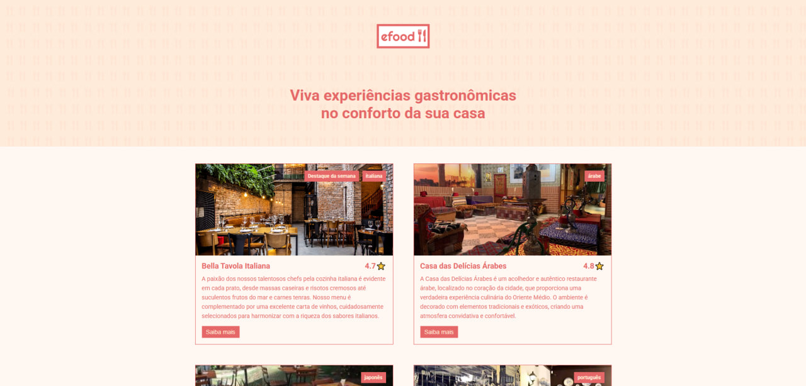
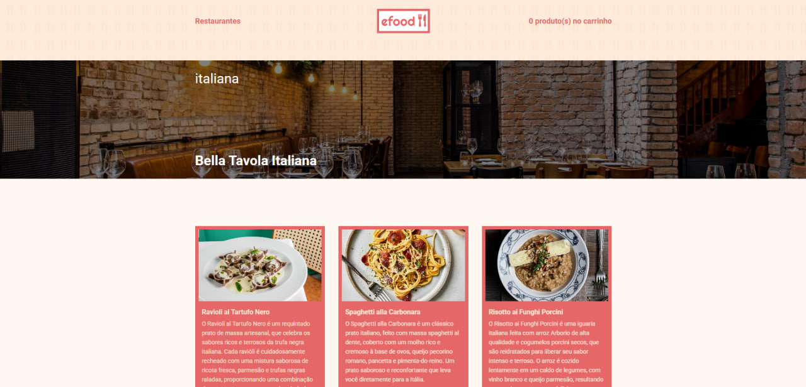
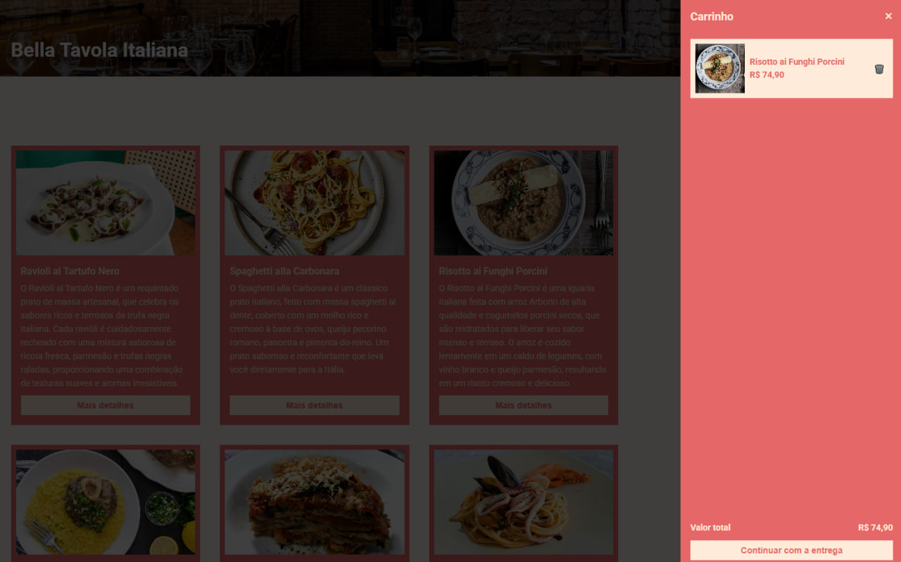
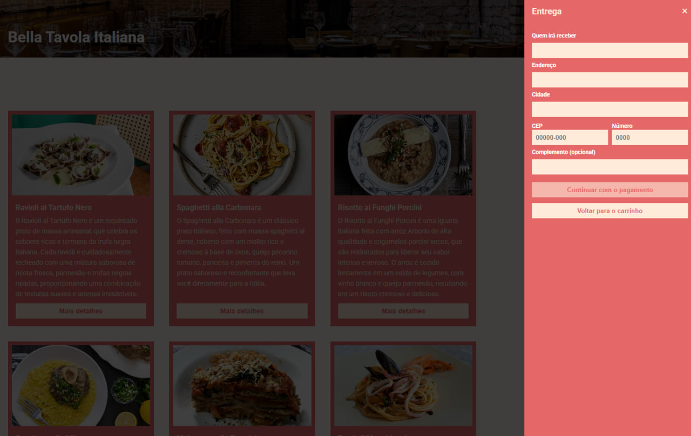

🍔 EFOOD — E-commerce de Restaurante

Aplicação web de e-commerce focada em restaurantes, desenvolvida com React + TypeScript, permitindo ao usuário navegar por estabelecimentos, visualizar cardápios e adicionar itens ao carrinho de compras.

🚀 Demonstração

🔗 Acesse o projeto:
https://efood-projeto6-coral.vercel.app/

📸 Preview

✨ Funcionalidades

📋 Listagem de restaurantes
🍽️ Visualização de cardápios
🛒 Adição e remoção de itens no carrinho
💰 Cálculo automático do total
📦 Simulação de finalização de pedido
🔍 Interface responsiva e moderna

🛠️ Tecnologias utilizadas
React
TypeScript
Styled Components / CSS Modules
Redux / Context API
React Router
Vite / CRA

📂 Estrutura do projeto
src/
├── assets/        # Imagens e ícones
├── components/    # Componentes reutilizáveis
├── pages/         # Páginas da aplicação
├── services/      # Integrações e APIs
├── store/         # Gerenciamento de estado
├── styles/        # Estilos globais
└── App.tsx

⚙️ Como rodar o projeto
1. Clone o repositório
git clone https://github.com/Finagoth/efood.git
2. Acesse a pasta
cd efood
3. Instale as dependências
npm install
4. Execute o projeto
npm run dev
📦 Build para produção
npm run build
🎯 Objetivo do projeto

Este projeto foi desenvolvido com foco em:

Praticar React com TypeScript
Trabalhar com componentização
Simular fluxo real de e-commerce
Melhorar organização de código e estrutura de projetos front-end
📈 Possíveis melhorias
Integração com API real
Sistema de autenticação (login)
Persistência do carrinho (localStorage ou backend)
Pagamento online
Testes automatizados

👨‍💻 Autor

Desenvolvido por Lucas Calíope

🔗 LinkedIn: (https://www.linkedin.com/in/lucas-caliope09/)

🔗 GitHub: (https://github.com/Finagoth)

📄 Licença

Este projeto está sob a licença MIT.
